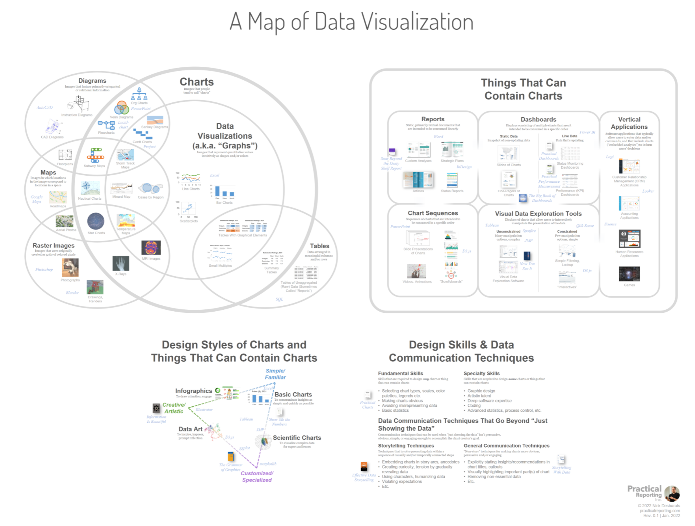

# Introduction to Data Visualization

Data visualization is the representation of numbers with visual elements.

This document goes with the [Introduction to Data Visualization](introduction_to_dv.pptx).

---
# What is a graph?

Not a table!

Tables are not charts! A chart is a data mapped to a visual element (such as size or height). In contrast, a table has rows and columns with numbers.

[Website with tables](https://www.are.na/joshua-kopin/tabular-presentation)

---

Tablet from 13th century BC, showing inventory of shepherds & herds. Linear B, palce of Pylos. Image taken by Nathan Garrett, 2024.

---
## Sample

[Explanation of Cuneform text](https://www.datafix.com.au/BASHing/2020-08-12.html)

---
## Example Mapping

---

# EDA

We follow a general process of EDA.

---
# Channels

We can map numbers to different visual channels (also called pre-attentive attributes).

- Position on a common scale
- Position on unaligned scale
- Length
- Tilt
- Area
- Color luminescence or brightness
- Color saturation or intensity
- Curvature
- Volume: one of the least accurate approaches
- Depth (3D): generally is best to avoid

---

In accuracy,

1. Position (common scale, then stacked, and unaligned)
1. Length (unstacked, then stacked)
1. Angle (for pie charts)
1. Area (rectangular is slightly better than circular)

** Activity - Replicate Cleveland and McGill study **

---

# Storytelling

Compare the mean (x) versus residuals (difference between mean and actual value).

Distributions can be normal (bell curve) or uniform (equally distributed), or skewed (more small or large). 
They can also have an increasing or decreasing spread. 
An outlier can throw off a pattern.
Bimodal means that you have 2 normal curves overlapped. 
Categorical data shows up at only certain spots. 

---

# References
