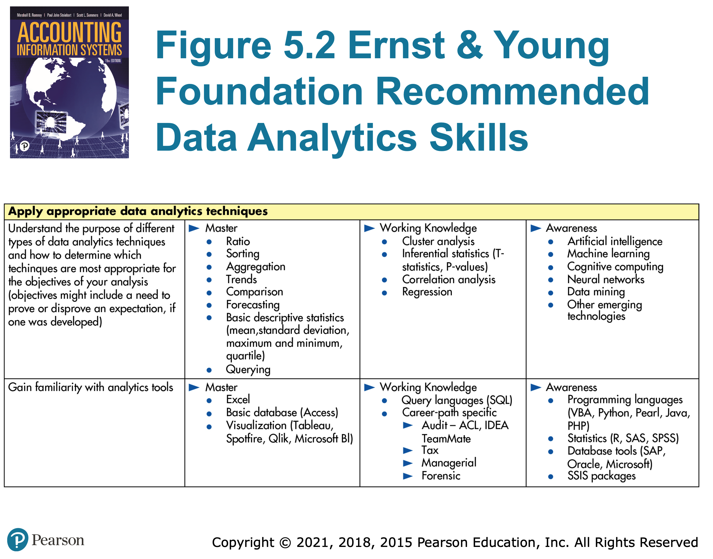
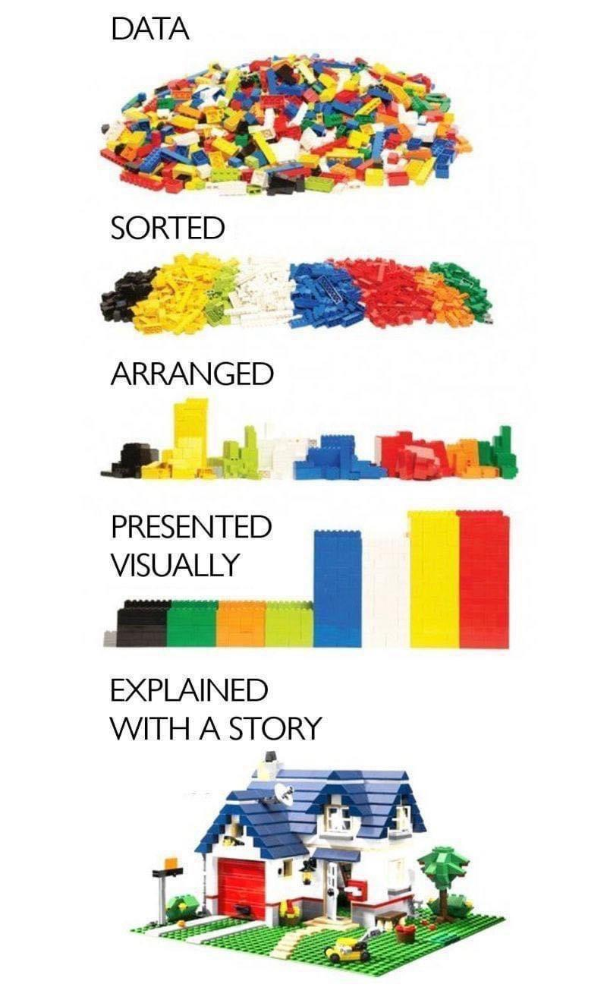
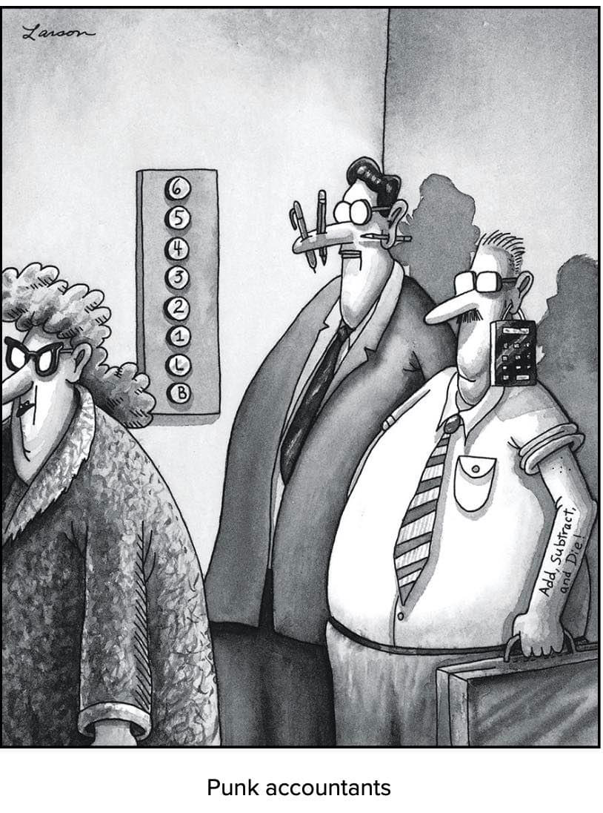

# How does this course fit into data analytics?

## What is EDA?

*Exploratory data analysis* is our primary approach

- Exploratory
- Data
- Analysis

Compare against *confirmatory data analysis*, more commonly used in your statistics class with hypothesis testing.

More focused on business data. CDA generally assumes that we do not have complete data and are sampling a larger population. With EDA, we often have 100% of the available data (for example, sales).
## EDA Process

We can visualize EDA with legos:

- Examine data values and structure
	- Values
		- Look for missing values, outliers, codings, etc...
		- Identify type:
			- String or number (integer v. decimal)
			- Continuous v. discrete
	- Structure
		- Long v. wide data, roll-up, cross-sectional, etc...
- Visualize each variable
	- Map data using pre-attentive attributes
	- Avoid perceptional problems
	- Identify distributions:
		- Normal curve, uniform, exponential, bimodal
- Look for correlations between variables
	- Visualize relationship between variables
	- Find cause and effect
	- Find moderating or mediator variables
- Tell a story
	- Develop a thesis
	- Create good data visualizations
	- Create a report or presentation	- 

*Example*

## Why care?

We need to move beyond traditional skillsets! It's no longer 'good enough' to have your core skills, you need to be able to pair those with data skills.

## Activity

- Fill out our [personal data class survey](https://forms.gle/MJNVN6v4yYjcy5zg9)
- Complete a [quizlet](https://quizlet.com/1049082074/course_dv01-exploratory-data-analysis-eda-flash-cards/)
