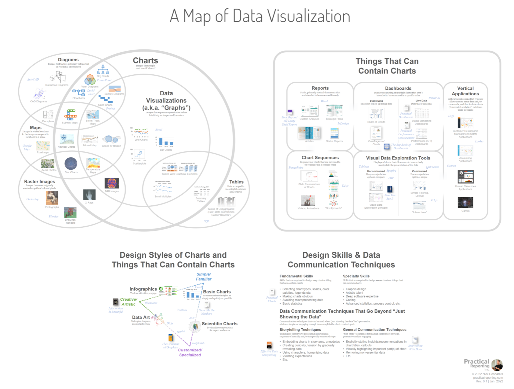

# Mapping values to visual elements through Pre-attentive attributes

Data visualization is the representation of *numbers* with *visual elements*. There are a variety of ways we can do this, so we call each mapping as a pre-attentive attribute.
# What is a table?

A table has rows and columns with numbers. The below shows an inventory of shepherds and herd from 1300BC. You can see that it has rows and columns, each with a cell recording data. **A table is not a chart!**

Tablet from 13th century BC, showing inventory of shepherds & herds. Linear B, palace of Pylos. Image taken by Nathan Garrett, 2024.

Historical tables:
 - [Explanation of Cuneform text](https://www.datafix.com.au/BASHing/2020-08-12.html)
- [Website with tables](https://www.are.na/joshua-kopin/tabular-presentation)

# Graphs use visual channels

A graph maps a number to a visual attribute. How many chart types can you think of to visualize this data?

**Number of World Heritage Sites**

| Country | Norway | Denmark | Sweden |
| ------- | ------ | ------- | ------ |
| 2004    | 5      | 3       | 13     |
| 2022    | 8      | 10      | 15     |

See [samples]([https://100.datavizproject.com/](https://100.datavizproject.com/))

Visual channels are also called pre-attentive attributes. Below are common channels:

- Position on a common scale
- Position on unaligned scale
- Length
- Tilt
- Area
- Color luminescence or brightness
- Color saturation or intensity
- Curvature
- Volume
- Depth (3D)

![[preattentive1.png|200]]

![[preattentive2.png|200]]
[Image source socviz](https://socviz.co/lookatdata.html)
### Accuracy

How do these compare in accuracy? [Class activity](perceptual-accuracy.html)

[Results]([https://docs.google.com/spreadsheets/d/1U4MlF3lM2NdqNAP06PSXvw19C8HW_1FATjNxUgS9-K0/)

Below are some charts showing the results of a crowd-sourced activity measuring accuracy. They are grouped into the (roughly-speaking) four levels of accuracy.

![[error02.png]]

![[error03.png]]

![[error04.png]]
![[error05.png]]

*Images from Heer and Bostock’s replication of Cleveland and McGill.  Source https://socviz.co/lookatdata.html *

To summarize, in order from best to to worst:

1. Position (common scale, then stacked, and unaligned)
1. Length (unstacked, then stacked)
1. Angle (for pie charts)
2. Area (rectangular is slightly better than circular)

## Mapping of different data visualization types

# References

- [Quizlet](https://quizlet.com/1049085197/course_dv02-introduction-to-data-visualization-flash-cards)
- [Socviz website's Look at Data](https://socviz.co/lookatdata.html)
- [Sample charts in a slideshow](sample-charts.pptx)
